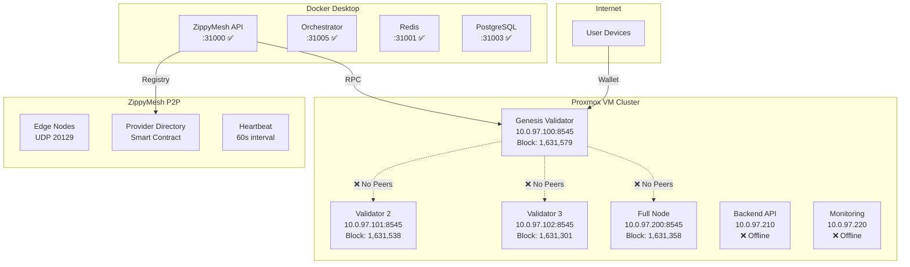
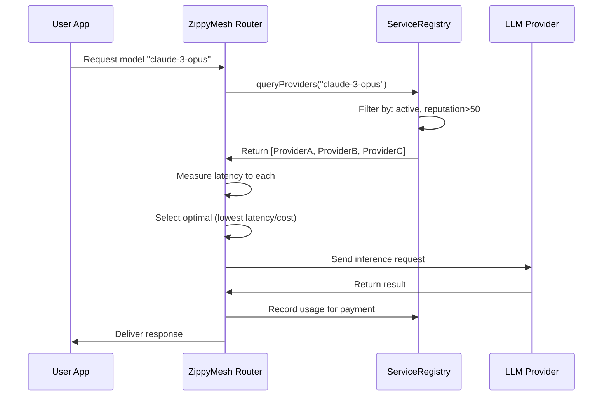
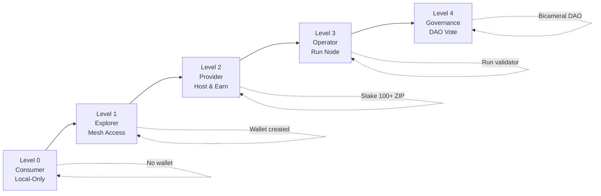

# ZippyMesh Network Upgrade Plan

## Executive Summary

This document outlines the comprehensive upgrade strategy for the ZippyCoin blockchain and ZippyMesh LLM Router P2P network. Based on network scanning, we will establish a stable core blockchain with sufficient edge nodes for production testing.

## Current Infrastructure

### Proxmox VM Cluster (10.0.97.x)

| VM | IP Address | Role | Expected Ports | Current Status |
|----|-----------|------|----------------|----------------|
| genesis | 10.0.97.100 | Validator | 8545 (RPC), 30303 (P2P), 9042 (Cassandra) | ✅ Online, Block: 1,631,579 |
| validator2 | 10.0.97.101 | Validator | 8545, 30303, 9042 | ✅ Online, Block: 1,631,538 |
| validator3 | 10.0.97.102 | Validator | 8545, 30303, 9042 | ✅ Online, Block: 1,631,301 |
| fullnode | 10.0.97.200 | Full Node | 8545, 30303 | ✅ Online, Block: 1,631,358 |
| backend | 10.0.97.210 | Backend API | 3000, 4000, 5000 | ❌ Offline |
| monitoring | 10.0.97.220 | Monitoring | 9090, 3000, 8080 | ❌ Offline |

### Docker Desktop Services (Local)

| Service | Local Port | Status |
|---------|-----------|--------|
| ZippyMesh API | 31000 | ✅ Running |
| Redis | 31001 | ✅ Running |
| PostgreSQL | 31003 | ✅ Running |
| Orchestrator | 31005 | ✅ Running |

### ZippyMesh Local Services

| Service | Port | Status |
|---------|------|--------|
| HTTP API | 20128 | ✅ Running |
| P2P Discovery (UDP) | 20129 | ❌ Not Running |

## Critical Issues Identified

### 🔴 Issue #1: Validator Network Fragmentation

**Problem:** All validators have 0 peers and are on divergent chains.

**Impact:**
- No blockchain consensus
- Transactions not propagating
- Security compromised

**Fix Required:**
1. Open firewall ports 30303/tcp and 30303/udp on all validators
2. Configure bootstrap nodes in validator configs
3. Restart validators and verify peering

### 🔴 Issue #2: Block Number Divergence

**Problem:** 278 block difference between validators (1,631,579 vs 1,631,301)

**Fix Required:**
1. Sync all validators from genesis validator (highest block)
2. Consider chain wipe if forks are deep

### 🟡 Issue #3: Backend & Monitoring Offline

**Problem:** VMs 10.0.97.210 and 10.0.97.220 not responding

**Fix Required:**
1. Check VM power state in Proxmox
2. Verify network configuration
3. Start services

### 🟡 Issue #4: P2P Discovery Disabled

**Problem:** UDP beacon service not running locally

**Fix Required:**
1. Start discovery beacon on port 20129
2. Configure node identity
3. Test peer discovery

## Architecture Overview



## Phase 1: Critical Fixes (URGENT)

### Week 1-2: Fix Blockchain Connectivity

**Day 1-2: Validator Peering**
```bash
# On each validator (10.0.97.100-102, 200)

# 1. Open firewall
sudo ufw allow 30303/tcp
sudo ufw allow 30303/udp
sudo ufw allow from 10.0.97.0/24 to any port 8545

# 2. Update config.toml
p2p-port = 30303
max-peers = 50
bootstrap-nodes = [
  "enode://<genesis-enode>@10.0.97.100:30303",
  "enode://<validator2-enode>@10.0.97.101:30303",
  "enode://<validator3-enode>@10.0.97.102:30303"
]
discovery-enabled = true

# 3. Restart validator
sudo systemctl restart zippycoin-validator

# 4. Verify peers
curl -X POST http://10.0.97.100:8545 \
  -d '{"jsonrpc":"2.0","method":"net_peerCount","params":[],"id":1}'
```

**Day 3-4: Chain Sync**
```bash
# On validator2, validator3, fullnode

# 1. Stop validator
sudo systemctl stop zippycoin-validator

# 2. Backup chain data
cp -r ~/.zippycoin/chaindata ~/.zippycoin/chaindata.backup.$(date +%Y%m%d)

# 3. Wipe chain data
rm -rf ~/.zippycoin/chaindata

# 4. Start with sync from genesis
zippycoin-validator --syncmode full --bootnodes enode://<genesis>@10.0.97.100:30303

# 5. Monitor sync progress
watch -n 5 'curl -s -X POST http://localhost:8545 -d \'{"jsonrpc":"2.0","method":"eth_syncing","params":[],"id":1}\''
```

**Day 5: Start Offline VMs**
```bash
# In Proxmox web interface or via CLI
qm start 210  # backend VM
qm start 220  # monitoring VM

# Verify they boot correctly
ping 10.0.97.210
ping 10.0.97.220
```

## Phase 2: Service Discovery Implementation

### Week 2-3: Deploy Service Registry

**Step 1: Deploy Smart Contract**
```solidity
// ServiceRegistry.sol
struct Provider {
    address owner;
    string endpoint;
    uint256 collateral;      // Minimum 100 ZIP
    uint256 reputation;
    uint256 pricePerToken;
    bytes32[] capabilities;
    bool isActive;
    uint256 lastHeartbeat;
    uint256 consecutiveFailures;
}

mapping(address => Provider) public providers;
mapping(bytes32 => address[]) public capabilityIndex;

function register(string calldata endpoint, uint256 pricePerToken) external payable {
    require(msg.value >= 100 ether, "Minimum 100 ZIP collateral required");
    require(bytes(endpoint).length > 0, "Endpoint required");
    
    providers[msg.sender] = Provider({
        owner: msg.sender,
        endpoint: endpoint,
        collateral: msg.value,
        reputation: 100, // Starting reputation
        pricePerToken: pricePerToken,
        capabilities: new bytes32[](0),
        isActive: true,
        lastHeartbeat: block.timestamp,
        consecutiveFailures: 0
    });
    
    emit ProviderRegistered(msg.sender, endpoint);
}

function heartbeat() external {
    Provider storage p = providers[msg.sender];
    require(p.isActive, "Provider not active");
    
    p.lastHeartbeat = block.timestamp;
    p.consecutiveFailures = 0;
    
    emit Heartbeat(msg.sender, block.timestamp);
}

function getActiveProviders() external view returns (address[] memory) {
    // Return providers with heartbeat within last 5 minutes
}
```

**Step 2: Implement Heartbeat Service**
```javascript
// src/lib/heartbeat.js
export class HeartbeatService {
  constructor(providerAddress, privateKey) {
    this.providerAddress = providerAddress;
    this.privateKey = privateKey;
    this.interval = 60000; // 60 seconds
    this.timer = null;
  }

  async start() {
    // Send initial heartbeat
    await this.sendHeartbeat();
    
    // Schedule regular heartbeats
    this.timer = setInterval(() => this.sendHeartbeat(), this.interval);
    
    console.log('[Heartbeat] Service started');
  }

  async sendHeartbeat() {
    try {
      const tx = await this.contract.heartbeat();
      await tx.wait();
      console.log('[Heartbeat] Sent at', new Date().toISOString());
    } catch (err) {
      console.error('[Heartbeat] Failed:', err.message);
    }
  }

  stop() {
    if (this.timer) {
      clearInterval(this.timer);
      this.timer = null;
    }
  }
}
```

**Step 3: Enable P2P Discovery**
```javascript
// Start beacon service
const { discoveryService } = require('./src/lib/discovery/localDiscovery');
await discoveryService.startBeacon();

// This will:
// - Broadcast UDP beacons on port 20129 every 30 seconds
// - Listen for peer beacons
// - Auto-provision discovered nodes to local database
```

## Phase 3: Mesh Network Security & Routing

### Multi-Layer Security Model

```
┌─────────────────────────────────────────────┐
│ Layer 4: Application Security               │
│ - Rate limiting per provider                │
│ - API key validation                        │
│ - Request signing with Dilithium            │
├─────────────────────────────────────────────┤
│ Layer 3: Payment Security                   │
│ - HTLC atomic swaps                         │
│ - State channel micropayments               │
│ - Weekly auto-settlement                    │
├─────────────────────────────────────────────┤
│ Layer 2: Directory Security                 │
│ - Smart contract access control             │
│ - Provider reputation scoring               │
│ - Minimum collateral (100 ZIP)              │
├─────────────────────────────────────────────┤
│ Layer 1: Transport Security                 │
│ - TLS 1.3 for HTTP endpoints                │
│ - Noise protocol for P2P                    │
│ - DHT with signature verification           │
└─────────────────────────────────────────────┘
```

### Provider Discovery Flow



### Reputation System

**Factors:**
- Uptime percentage (0-50 points)
- Response latency (0-25 points)
- Token accuracy/quality (0-15 points)
- User ratings (0-10 points)

**Penalties:**
- Missed heartbeat: -5 points
- Failed request: -10 points
- Timeout: -15 points
- Fraud detected: Collateral slashed, banned

## Phase 4: User Participation Framework

### Four-Level Model



### Level 0: Consumer
- Uses local LLM engines only (Ollama, LM Studio)
- No wallet required
- No blockchain interaction
- Completely private

### Level 1: Explorer
- Wallet generated (Dilithium + Ed25519 keys)
- Can browse provider directory
- Access to mesh-hosted models
- Read-only blockchain access

### Level 2: Provider
- Stake 100+ ZIP tokens as collateral
- Host LLM models for others
- Earn tokens per token generated
- Submit heartbeat proofs every 60s

### Level 3: Operator
- Run validator or full node
- Participate in consensus
- Validate environmental entropy
- Higher staking rewards

### Level 4: Governance
- Bicameral DAO participation
- Create and vote on proposals
- Protocol parameter changes
- Treasury management

### Wallet Generation Module

```javascript
// src/lib/wallet/originWallet.js
import { dilithium } from 'pqc-dilithium';
import { ed25519 } from '@noble/curves/ed25519';
import { mnemonicToSeedSync } from 'bip39';

export class OriginWallet {
  constructor(mnemonic) {
    this.mnemonic = mnemonic;
    this.seed = mnemonicToSeedSync(mnemonic);
    this.generateKeys();
  }

  generateKeys() {
    // Primary: Dilithium-5 (post-quantum)
    this.dilithiumKeypair = dilithium.keyPair.fromSeed(this.seed.slice(0, 32));
    
    // Secondary: Ed25519 (signing)
    this.ed25519Keypair = ed25519.utils.randomPrivateKey();
    this.ed25519PublicKey = ed25519.getPublicKey(this.ed25519Keypair);
  }

  async signTransaction(tx) {
    // Use Dilithium for on-chain transactions
    const txHash = keccak256(JSON.stringify(tx));
    return dilithium.sign(txHash, this.dilithiumKeypair.secretKey);
  }

  async signMessage(message) {
    // Use Ed25519 for off-chain messages
    const messageBytes = new TextEncoder().encode(message);
    return ed25519.sign(messageBytes, this.ed25519Keypair);
  }

  getAddress() {
    // Derive Ethereum-compatible address from Dilithium pubkey
    return '0x' + keccak256(this.dilithiumKeypair.publicKey).slice(-40);
  }
}
```

## Phase 5: Testing & Production

### 72-Hour Stability Test Checklist

- [ ] All validators maintain sync (blocks within 3 of each other)
- [ ] Peer count ≥ 2 on each validator
- [ ] Heartbeat service submitting every 60s
- [ ] Provider discovery working
- [ ] Request routing functional
- [ ] No memory leaks
- [ ] Automatic failover working

### Production Deployment Order

1. Deploy ServiceRegistry contract to genesis validator
2. Deploy edge nodes (3-5 instances)
3. Configure mesh routing paths
4. Integrate LLM Router with provider discovery
5. Enable user wallet generation
6. Launch governance DAO

## Quick Reference Commands

### Check All Validators
```bash
# Check block numbers
for ip in 100 101 102 200; do
  echo -n "10.0.97.$ip: "
  curl -s -X POST http://10.0.97.$ip:8545 \
    -d '{"jsonrpc":"2.0","method":"eth_blockNumber","params":[],"id":1}' \
    | jq -r '.result' | xargs printf "%d\n"
done
```

### Check Peer Count
```bash
curl -X POST http://10.0.97.100:8545 \
  -d '{"jsonrpc":"2.0","method":"net_peerCount","params":[],"id":1}' \
  | jq -r '.result' | xargs printf "%d peers\n"
```

### Test ZippyMesh API
```bash
curl http://localhost:20128/api/v1/models | jq
```

### Start P2P Discovery
```bash
node -e "
const { discoveryService } = require('./src/lib/discovery/localDiscovery');
discoveryService.startBeacon().then(() => console.log('Beacon started'));
"
```

---

**Document Version:** 1.0  
**Created:** 2026-03-02  
**Last Updated:** 2026-03-02  
**Next Review:** After Phase 1 fixes