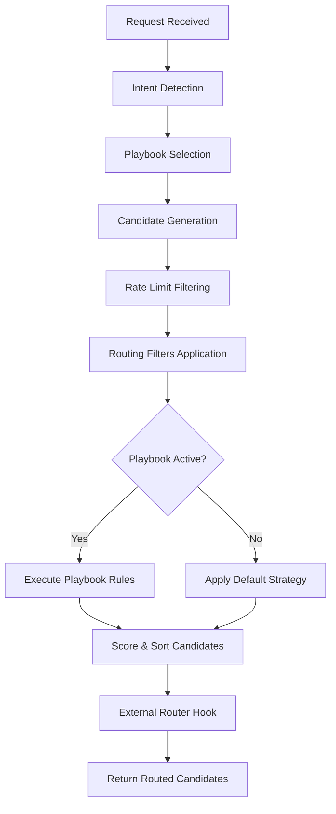
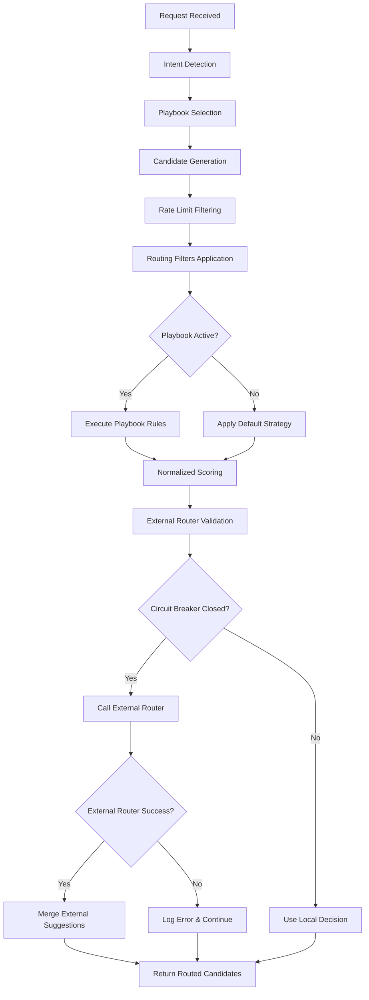

# Routing Engine Architecture Review

## Summary

This document provides architectural recommendations for the ZippyMesh LLM Router's routing engine based on a comprehensive review of the current implementation.

## Key Findings

### Strengths
1. **Modular Design**: The routing engine is well-structured with clear separation of concerns
2. **Comprehensive Failover**: Multi-layer failover mechanism ensures high availability
3. **Intent Detection**: Sophisticated NLP-based intent detection with session awareness
4. **Extensibility**: External router hook allows for custom routing strategies
5. **Performance Optimizations**: Efficient caching and batching strategies

### Areas for Improvement
1. **Scoring Algorithm Complexity**: The scoring mechanism uses large constants that may cause overflow issues
2. **External Router Validation**: Could benefit from more robust validation and timeout handling
3. **Memory Usage**: Potential memory leaks in long-running processes due to caching
4. **Error Handling**: Some areas could benefit from more granular error handling
5. **Configuration Validation**: Missing validation for external router URLs and other settings

## Detailed Recommendations

### 1. Scoring Algorithm Refactor
**Issue**: The current scoring algorithm uses large constants (1,000,000, 10,000, etc.) which could lead to integer overflow or precision issues in extreme cases.

**Recommendation**: 
- Normalize scoring factors to a 0-1000 scale
- Use weighted averages instead of additive large constants
- Consider implementing a scoring function that's easier to tune and understand

### 2. External Router Enhancement
**Issue**: While the external router hook exists, it lacks comprehensive validation and fallback mechanisms.

**Recommendation**:
- Add URL validation (ensure it's a valid HTTP/HTTPS URL)
- Implement circuit breaker pattern for external router failures
- Add more detailed logging for debugging external router interactions
- Consider allowing configuration of HTTP method and headers

### 3. Memory Management Improvements
**Issue**: Several caches (localModelCache, registryModelCache) could grow indefinitely in long-running processes.

**Recommendation**:
- Implement LRU (Least Recently Used) eviction policies for caches
- Add cache size limits and monitoring
- Consider using weak references where appropriate
- Add cache hit/miss metrics for observability

### 4. Error Handling Enhancement
**Issue**: Some error handling is too broad (catch-all exceptions) which can hide real issues.

**Recommendation**:
- Replace broad catch blocks with specific exception handling
- Add more contextual information to error logs
- Consider implementing error categorization (recoverable vs fatal)
- Add error rate limiting to prevent log spam

### 5. Configuration Validation
**Issue**: Missing validation for configuration values like externalRouterUrl.

**Recommendation**:
- Add validation hooks for configuration changes
- Implement schema validation for complex settings
- Provide meaningful error messages for invalid configurations
- Consider adding configuration hot-reload with validation

### 6. Performance Monitoring
**Issue**: Limited visibility into routing decision performance.

**Recommendation**:
- Add timing metrics for each routing stage
- Implement histogram tracking for decision latency
- Add counters for cache hits/misses
- Consider integrating with OpenTelemetry for distributed tracing

### 7. Code Quality Improvements
**Issue**: Some areas could benefit from refactoring for better readability.

**Recommendation**:
- Extract complex logic into well-named helper functions
- Add JSDoc comments for complex algorithms
- Consider using TypeScript for better type safety
- Add unit tests for edge cases in scoring and failover logic

## Implementation Priority

1. **High Priority**: Scoring algorithm refactor, external router validation
2. **Medium Priority**: Memory management improvements, error handling enhancement
3. **Low Priority**: Configuration validation, performance monitoring, code quality improvements

## Diagrams

### Current Routing Flow

### Enhanced Routing Flow with Recommendations

## Conclusion

The routing engine demonstrates solid architectural foundations with room for targeted improvements. Implementing these recommendations will enhance reliability, maintainability, and performance while preserving the existing functionality that works well.
